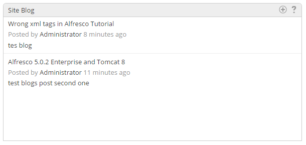

Site Blog Dashlet for Alfresco Share 5.0.2
====================================

Author: Muralidharan Deenathayalan

Thanks Will Abson for the original Site Blog Dashlet.

This dashlet is migrated from Alfresco 4.x version to Alfresco Share 5.0.2 version.

Please refer the below URI for the original post,if you're looking for Alfresco 4.x version.
https://github.com/share-extras/site-blog-dashlet

This add-on provides a dashlet to display the last ten blog posts and submit new posts from the site dashboard.

The _Create Post_ action provided by the dashlet allows quick and easy creation of new blog posts without leaving the dashboard.

Once is added successfully, the dashlet will be updated.

For installation and deployment steps, please refer the below URI.
https://github.com/share-extras/site-blog-dashlet